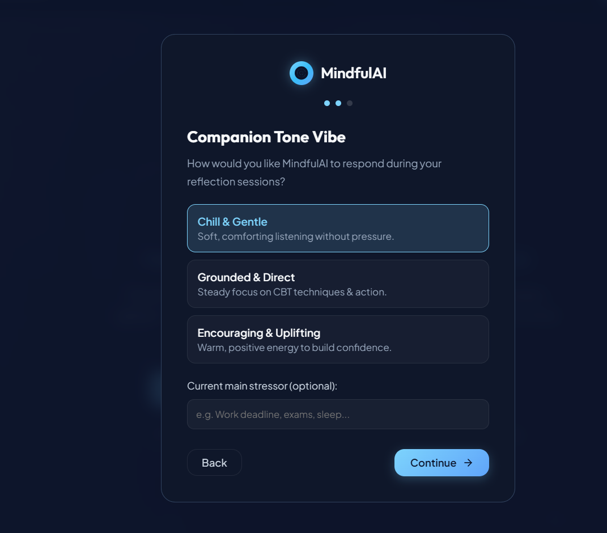

# MindfulAI — Mental Wellness & Reflection Companion

## 1. Overview
MindfulAI is an empathetic, AI-powered reflection companion designed to give individuals a gentle, judgment-free space to pause, reflect, and regulate their emotional well-being. Framed explicitly as a **wellness and self-reflection companion** rather than a licensed medical or therapy service, MindfulAI blends evidence-based self-care practices (Cognitive Behavioral Therapy reframing, 4-7-8 rhythm breathing, and 5-4-3-2-1 sensory grounding) with contextual AI dialogue powered by Google Generative AI (Gemini 1.5 Flash).

## 2. Links
- **Live Demo**: [https://mindfullness-ai.netlify.app](https://mindfullness-ai.netlify.app)
- **GitHub Repository**: [https://github.com/btw-saanvi/Mindfullness-AI](https://github.com/btw-saanvi/Mindfullness-AI)

## 3. Features

### Contextual AI Reflection Companion
- **Adaptive Persona Styles**: Switch between **Calm**, **Motivational**, **CBT (Thought Reflection)**, and **Mindfulness** personas.
- **Tone Vibe Selector**: Choose how your companion responds — **Chill** (casual & low-pressure), **Grounded** (steady & centering), or **Uplifting** (energizing & encouraging).
- **Listening Companion Orb**: Pulsing ambient orb widget providing real-time visual feedback on listening and reflection states.

### Structured Session Workflow ("Pick Your Need")
- **Session Entry Modals**: Choose a focused reflection track before chatting:
  - 🌿 *Vent Thoughts*: A non-judgmental container to unburden whatever is on your mind.
  - 🔍 *Reframe a Thought*: Structured examination of unhelpful mental loops.
  - 🌊 *Calm Down*: Grounding exercises for moments of anxiety or sensory overwhelm.
  - 🎯 *Daily Intention*: Centering thoughts for the morning or day ahead.
- **Pre-Session Mood Check-in**: 1–10 interactive mood slider that calibrates the companion's tone.
- **Post-Session AI Summary**: Automated session recap with key reflection points and one actionable takeaway.

### Tangible Therapeutic Tools
- **CBT Thought Reframing Worksheet**: Interactive 3-step reframing exercise (*Automatic Thought -> Evidence Against -> Balanced Perspective*) with AI-powered supportive validation.
- **Guided 4-7-8 Breathing**: Synchronized animated visualizer guiding 4s inhale, 7s hold, and 8s exhale cycles.
- **5-4-3-2-1 Sensory Grounding**: Step-by-step checklist to de-escalate anxiety through tactile, visual, and auditory cues.

### Mood & Progress Dashboard
- **Mood Trend Bar Chart**: Visual representation of mood evaluations across the last 14 check-ins.
- **Self-Care Streak Tracker**: Real-time counter of consecutive days with active check-ins.
- **Soft Pattern Insights**: Non-clinical pattern observations (e.g., *"Notice: You've experienced heavy moments recently—take a gentle breathing break"*).
- **Mood-Aware Daily Affirmation**: Dynamic, personalized affirmation synthesized from recent mood logs, session themes, and stated stressors with single-click refresh.

### Personalization & Onboarding
- **3-Step Onboarding Flow**: Captures primary wellness goal, preferred companion vibe, and primary source of tension.
- **Session History Log**: Review prior session timelines, message count previews, and saved summaries.

## 4. Screenshots / Demo



## 5. Tech Stack

- **Frontend**: React 19, Vite 7, Framer Motion, Lucide React Icons, Axios
- **Backend**: Python 3.10+, FastAPI, Google Generative AI (`google-generativeai`), Pydantic v2, Uvicorn
- **Authentication**: Google OAuth2 (`@react-oauth/google` + `google-auth`)
- **Hosting**: Netlify (Frontend) + Render (Backend)

## 6. Live Demo

The live demo of the application is available here: [https://mindfullness-ai.netlify.app](https://mindfullness-ai.netlify.app)

## 7. Setup Instructions

### Prerequisites
- Node.js 18+ and npm
- Python 3.10+
- Google Gemini API Key ([Google AI Studio](https://aistudio.google.com/))

### 1. Backend Setup
```bash
cd backend

# Create virtual environment
python -m venv venv
# Activate virtual environment
# Windows:
venv\Scripts\activate
# macOS/Linux:
source venv/bin/activate

# Install dependencies
pip install -r requirements.txt

# Create .env file
echo GOOGLE_API_KEY=your_gemini_api_key_here > .env

# Run FastAPI development server
uvicorn main:app --reload --port 8000
```
Backend API will be available at: `http://localhost:8000` (Interactive docs at `http://localhost:8000/docs`).

### 2. Frontend Setup
```bash
cd frontend/client

# Install dependencies
npm install

# Run Vite development server
npm run dev
```
Frontend application will be running at: `http://localhost:5173`.

### Environment Variables

#### Backend (`backend/.env`)
```env
GOOGLE_API_KEY=your_google_gemini_api_key
```

#### Frontend (`frontend/client/.env`)
```env
VITE_API_URL=http://localhost:8000
VITE_GOOGLE_CLIENT_ID=your_google_client_id.apps.googleusercontent.com
```

### Deployment

- **Frontend (Netlify)**:
  - Build command: `npm run build`
  - Publish directory: `frontend/client/dist`
  - Environment variable: `VITE_API_URL=https://your-backend.onrender.com`
- **Backend (Render)**:
  - Environment: Python 3
  - Build command: `pip install -r requirements.txt`
  - Start command: `uvicorn main:app --host 0.0.0.0 --port $PORT`
  - Environment variable: `GOOGLE_API_KEY=your_gemini_key`

## 8. Technical Decisions

1. **FastAPI Backend**:
   - Chosen for asynchronous request handling, native OpenAPI schema generation, and high-performance Pydantic data validation.
2. **Decoupled Architecture (`ai_service.py` & `config.py`)**:
   - Isolates external AI dependencies from HTTP routing logic, making the codebase modular, testable, and ready for alternative LLM providers (e.g., Groq / Claude).
3. **In-Memory Session Architecture**:
   - Structured dictionaries (`user_sessions`, `user_mood_logs`, `user_preferences_store`) allow zero-friction local development and low-latency testing without requiring external database provisioning.
4. **Vite + React 19 Frontend**:
   - Instant HMR, minimal bundle size, and high render performance.
5. **Vanilla CSS Design System**:
   - Bespoke CSS tokens with smooth glassmorphism, responsive flex/grid layouts, and warm color palettes (`#7dd3fc` pastel blue, dark navy `#0b1329`, and soft neutrals) avoiding bloated CSS framework dependencies.

### System Architecture

```
┌─────────────────────────────────────────────────────────────┐
│                    Client (React + Vite)                    │
│                                                             │
│   Landing Page  │  Chat Interface  │  Therapeutic Tools     │
│   Auth (OAuth)  │  Mood Dashboard  │  Session History       │
└──────────────────────────────┬──────────────────────────────┘
                               │  REST API (Axios / JSON)
                               ▼
┌─────────────────────────────────────────────────────────────┐
│                   Backend (FastAPI Engine)                  │
│                                                             │
│   ┌─────────────────────────────────────────────────────┐   │
│   │ API Routes (main.py)                                │   │
│   │  /chat  /session/start  /session/end  /cbt-reframe  │   │
│   │  /dashboard  /history  /daily-affirmation  /health   │   │
│   └──────────────────────────┬──────────────────────────┘   │
│                              │                              │
│   ┌──────────────────────────▼──────────────────────────┐   │
│   │ AI Service Layer (ai_service.py)                    │   │
│   │  • Crisis Detection & Boundary Interceptor          │   │
│   │  • Persona & Vibe Prompt Synthesis                  │   │
│   │  • Resilient Error Handling (429/503/422 Mapping)   │   │
│   └──────────────────────────┬──────────────────────────┘   │
│                              │                              │
│   ┌──────────────────────────▼──────────────────────────┐   │
│   │ Config & In-Memory Store (config.py / main.py)      │   │
│   │  • Session State  • Mood Logs  • Preferences Store  │   │
│   └─────────────────────────────────────────────────────┘   │
└──────────────────────────────┬──────────────────────────────┘
                               │
                               ▼
┌─────────────────────────────────────────────────────────────┐
│             External Services & Integrations                │
│                                                             │
│   • Google Generative AI (Gemini 1.5 Flash API)             │
│   • Google Identity Services (OAuth2 ID Token Auth)         │
└─────────────────────────────────────────────────────────────┘
```

### Responsible AI & Safety Interceptor

MindfulAI maintains strict boundary controls to guarantee ethical, safe, and defensible operation:

1. **Non-Clinical Positioning**:
   - MindfulAI is positioned as a **reflection and wellness tool**, not a clinical therapy service or licensed medical provider.
   - The app does not provide psychiatric diagnoses, medical prescriptions, or clinical treatment plans.
   - Persistent disclaimer banners are displayed across all conversational and reflection screens.

2. **Automated Crisis-Language Interception**:
   - Real-time keyword analysis intercepts expressions of self-harm, suicidal ideation, or severe acute crisis (`suicide`, `kill myself`, `end my life`, `self harm`, etc.).
   - Standard conversational generation is immediately interrupted. The system outputs immediate crisis support resources:
     - **988 Suicide & Crisis Lifeline**: Call/Text 988 (US & Canada, 24/7)
     - **Crisis Text Line**: Text `HOME` to 741741
     - **AASRA India Helpline**: +91-9820466726
     - **International Lifelines**: [findahelpline.com](https://findahelpline.com/)

### Mood-Based Interaction Logic

MindfulAI tunes its prompts using a multi-factor context engine:

```
[User Input] + [Selected Persona] + [Tone Vibe] + [Mood Score (1-10)] + [Stressor Context]
                                    │
                                    ▼
                     [Prompt Synthesis Engine]
                                    │
                                    ▼
                     [Gemini 1.5 Flash Generation]
```

- **Mood Score <= 4 ("Heavy")**: The system softens pacing, uses validating and grounding language, and refrains from toxic positivity or unsolicited advice.
- **Mood Score 5-6 ("Neutral / Okay")**: The system adopts an exploratory, reflective posture to help untangle everyday stressors.
- **Mood Score >= 7 ("Bright / Grounded")**: The system encourages gratitude, consolidation of what is working, and positive reinforcement.
- **Need Parameter (`vent`, `reframe`, `calm`, `intention`)**: Dictates starter prompts and conversation structure.

### Resilient Error Handling Strategy

All interactions with Google Generative AI pass through the decoupled `ai_service.call_ai()` wrapper, ensuring high availability and secure failure states:

| Condition | Internal Handling | Client Response |
|-----------|-------------------|-----------------|
| **Rate Limit / Quota (429)** | Catches `ResourceExhausted` | HTTP 429: *"The AI service is temporarily busy due to high demand. Please wait a moment."* |
| **Permission / Auth (403)** | Catches `PermissionDenied` | HTTP 503: *"AI service configuration issue. Please verify backend credentials."* |
| **Network / Timeout** | Catches `Timeout` / `ConnectionError` | HTTP 503: *"Unable to connect to the AI service. Please check your connection."* |
| **Input Validation** | Pydantic `field_validator` | HTTP 422: Validates non-empty `user_id`, message length `<= 5000`, `mood_score` (1-10). |
| **Safety Filter Block** | Inspects `prompt_feedback` | Graceful fallback reflection message; no crash or raw exception. |
| **Offline / Missing Key** | Verifies `GOOGLE_API_KEY` | Seamless fallback responses without breaking session flow. |

### Repository Structure

```
Mindfullness-ai/
├── backend/
│   ├── ai_service.py         # Decoupled Google Generative AI integration & prompt logic
│   ├── config.py             # Centralized settings, CORS origins, and constants
│   ├── main.py               # FastAPI route handlers, Pydantic schemas, and in-memory store
│   ├── requirements.txt      # Python dependencies
│   └── .env                  # Backend environment variables (API keys)
├── frontend/
│   └── client/
│       ├── src/
│       │   ├── components/
│       │   │   ├── BreathingExercise.jsx   # Guided 4-7-8 breathing visualizer
│       │   │   ├── CBTWorksheet.jsx        # 3-step thought reframing interactive tool
│       │   │   ├── ChatInterface.jsx       # Adaptive companion chat & tone controls
│       │   │   ├── LandingPage.jsx         # Welcoming landing page & navigation
│       │   │   ├── Logo.jsx                # Reusable vector brand component
│       │   │   ├── MoodDashboard.jsx       # Mood trends, daily affirmation & stats
│       │   │   ├── OnboardingModal.jsx     # Goal, vibe, and stressor setup wizard
│       │   │   ├── SessionEntryModal.jsx   # Structured need & mood check-in modal
│       │   │   ├── SessionHistory.jsx      # Historical session review & recaps
│       │   │   ├── SignIn.jsx              # Google & email authentication
│       │   │   └── SignUp.jsx              # Account registration
│       │   ├── utils/
│       │   │   └── auth.js                 # Authentication token management
│       │   ├── App.jsx                     # Application routing & modal management
│       │   ├── App.css                     # Component-level styling
│       │   ├── index.css                   # Global CSS tokens & variables
│       │   └── main.jsx                    # React application root
│       ├── package.json
│       ├── vite.config.js
│       └── .env                            # Frontend environment variables
├── .gitignore                # Root gitignore excluding build & cache files
└── Readme.md                 # Complete system documentation
```

### Development History & Milestones

| Timeline | Milestone / Focus | Details |
|----------|-------------------|---------|
| **Aug – Sep 2025** | Initial Concept & Foundation | Core FastAPI server setup, initial Gemini API integration, and initial chat UI. |
| **Sep 2025** | Interactive Modals & Tools | Prototyping CBT worksheet logic, 4-7-8 breathing timers, and in-memory history endpoints. |
| **Aug 2026** | Architectural Refactoring | Decoupled `ai_service.py` module, centralized `config.py`, and structured error mapping (429/503/422). |
| **Aug 2026** | Mood-Aware Affirmations & UX | Added `/daily-affirmation` endpoint, dynamic dashboard affirmation card, and crisis intervention interceptors. |
